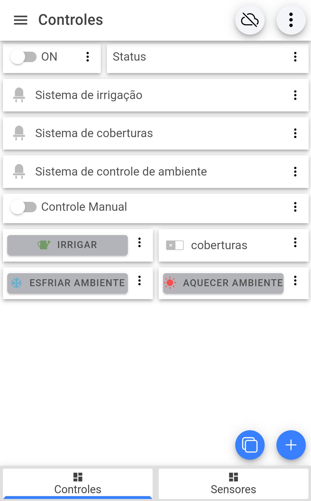
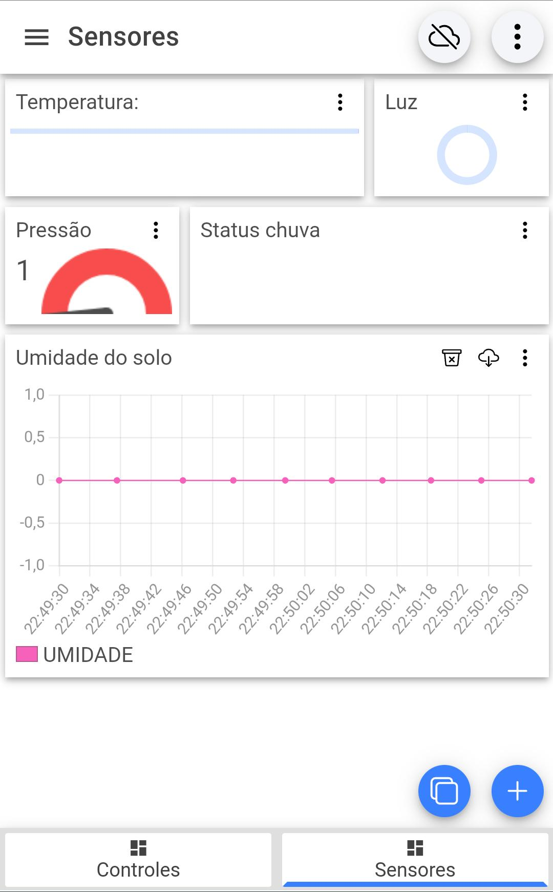

  

Este repositório contém o código-fonte e informações relacionadas a um projeto de Jardim Inteligente implementado usando microcontroladores ESP32 e Arduino Mega. O sistema utiliza o protocolo WiFi para comunicação física e o protocolo MQTT para comunicação de aplicação. O broker/servidor MQTT utilizado é o Mosquitto e a interface de usuário é apresentada por meio de um Dashboard construído usando o aplicativo IoT MQTT Panel.

## Estrutura do Projeto

### Sistema Embarcado

- **Microcontroladores:**
  - ESP32
  - Arduino Mega

- **Interface de Saída:**
  - 3 LEDs de cores diferentes (🔴 vermelho, 🟡 amarelo, 🟢 verde)

### Sistemas

1. **Sistema de Irrigação (🔴 LED Vermelho):**
   - Componentes: Válvulas, tubos de irrigação.
   - Ações: Sistema de irrigação das plantas.

2. **Sistema de Controle de Ambiente (🟡 LED Amarelo):**
   - Componentes: Ventiladores, nebulizadores, aquecedores elétricos, mantas térmicas.
   - Ações: Controle com base nas condições climáticas para proteger plantas do calor ou frio intenso.

3. **Sistema de Coberturas (🟢 LED Verde):**
   - Componentes: Coberturas, toldos e cortinas automáticas.
   - Ações: Cobertura de áreas sensíveis em dias de luz solar intensa.

### Estados

1. **Condição 1: Umidade do solo abaixo do nível desejado:**
   - Ativar o sistema de irrigação.

2. **Condição 2: Chuva detectada ou umidade do solo normal/alta ou pressão atmosférica significativamente baixa (possível chuva iminente):**
   - Desativar o sistema de irrigação.

3. **Condição 3: Temperatura muito alta:**
   - Ativar ventiladores e nebulizadores para resfriar o ambiente (ativar Sistema de Controle de Ambiente).

4. **Condição 4: Temperatura muito baixa:**
   - Ativar aquecedores elétricos e mantas térmicas para aquecer o ambiente (ativar Sistema de Controle de Ambiente).

5. **Condição 5: Temperatura normal:**
   - Desativar Sistema de Controle de Ambiente.

6. **Condição 6: Luminosidade muito intensa:**
   - Acionar coberturas para proteger as plantas da luz solar excessiva (ativar Sistema de Coberturas).

7. **Condição 7: Luminosidade normal:**
   - Desativar Sistema de Coberturas.

## Códigos-fonte

Os códigos-fonte estão organizados em três arquivos:

1. **Logger.hpp:**
   - Gerencia os sensores e registra suas leituras e eventos.
   - Implementa um sistema estático de log para leitura periódica dos sensores.

2. **MovingAvg.hpp:**
   - Implementa uma média móvel para suavizar leituras de sensores.

3. **Samplers.hpp:**
   - Contém funções de amostragem para diferentes sensores (BMP, umidade, luminosidade, chuva).

4. **greenhouse.ino:**
   - Código principal que configura e controla o sistema embarcado.
   - Estabelece a comunicação WiFi e MQTT.
   - Gerencia os LEDs e as ações com base nos eventos e condições dos sensores.

## Dashboard (feito no aplicativo IoT MQTT Panel)

### Página "Controles"

- Switch para ligar e desligar o sistema completo.
- Card mostrando o status do sistema (ligado ou desligado).
- Informações dos LEDs referentes aos sistemas de irrigação, coberturas e controle de ambiente.
- Switch para ativar o "Controle Manual".
- Botão "Irrigar" para acionar o sistema de irrigação (ativado apenas se o controle manual estiver ativado).
- Switch "Coberturas" para acionar o sistema de coberturas (ativado apenas se o controle manual estiver ativado).
- Botões "Esfriar ambiente" e "Aquecer ambiente" para acionar o sistema de controle de ambiente (ativados apenas se o controle manual estiver ativado).

### Página "Sensores"

- Painel mostrando temperatura (sensor BMP).
- Painel mostrando luminosidade (sensor LDR).
- Painel mostrando pressão (sensor BMP).
- Painel mostrando se está chovendo ou não (sensor de chuva).
- Gráfico da umidade do solo ao longo do tempo (sensor de umidade de solo).

 
  

  
  &nbsp;&nbsp;&nbsp;&nbsp;&nbsp;
  

